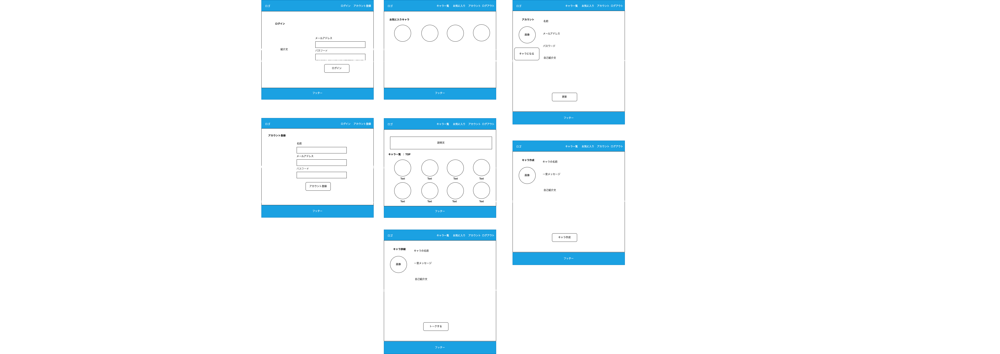
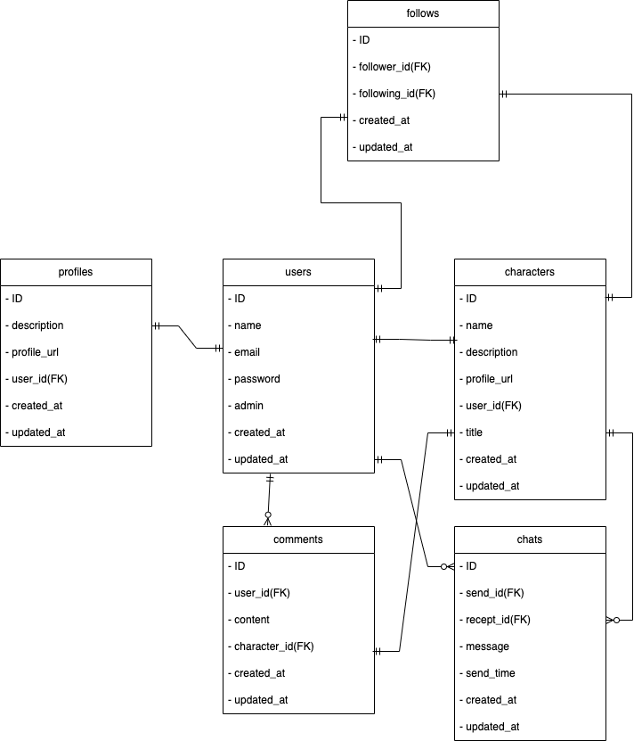

# README

## 開発言語

- Ruby 3.0.1
- Ruby on Rails 6.1.7

## 就業 Term の技術

- devise
- メッセージ機能

## カリキュラム外の技術

- active storage での画像表示

## 実行手順

```
git clone https://github.com/kazuhikochikae/original.git
cd original01
bundle install
rails db:create
rails db:migrate
rails s
```

## カタログ設計

[カタログ設計](https://docs.google.com/spreadsheets/d/1-ZRL_YKNkUGqa2USh-PKRZOvOGyI6Oob7XiATH5U3Kk/edit#gid=1096551642)

## テーブル定義書

[テーブル定義書](https://docs.google.com/spreadsheets/d/1-ZRL_YKNkUGqa2USh-PKRZOvOGyI6Oob7XiATH5U3Kk/edit#gid=494742262)

## ワイヤーフレーム



## ER 図



## 画面遷移図


